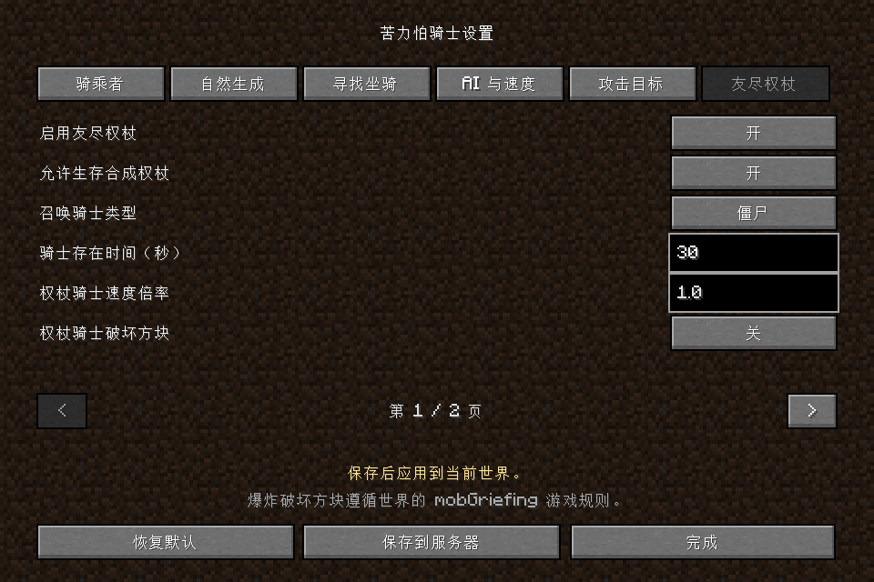
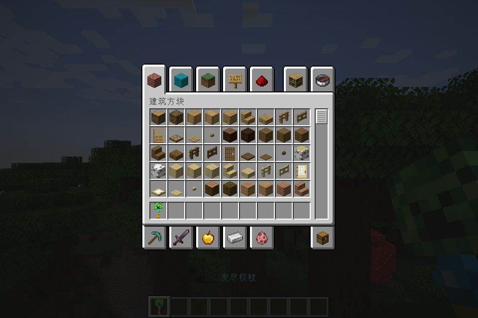

# 苦力怕骑士 Creeper Knight

让幼年僵尸家族骑上苦力怕，沿用骑乘者的 AI 寻路、追击并引爆。支持自然生成、指令召唤、管理员图形设置，以及可以锁定玩家的**友尽权杖**。

A Minecraft Java 1.20.1 mod for Forge and Fabric: baby zombie-family creeper jockeys, a server-controlled configuration screen, and a craftable player-targeting scepter. Includes Chinese and English translations.

**当前版本：0.2.1 · Minecraft Java 国际版：1.20.1 · Java：17 · 许可证：MIT**

[下载最新版本](https://github.com/Esnowflake/Creeper-Knight/releases/latest) · [测试与兼容性记录](TESTING.md) · [许可证](LICENSE)

## 下载与依赖

| 加载器 | 0.2.1 安装包 | 已验证的加载器与依赖 |
|---|---|---|
| Forge | [下载 Forge jar](https://github.com/Esnowflake/Creeper-Knight/releases/download/v0.2.1/creeper-knight-0.2.1-mc1.20.1-forge.jar) | Forge 47.4.10，无需 Fabric API |
| Fabric | [下载 Fabric jar](https://github.com/Esnowflake/Creeper-Knight/releases/download/v0.2.1/creeper-knight-0.2.1-mc1.20.1-fabric.jar) | Fabric Loader 0.16.14、Fabric API 0.92.2+1.20.1 |

目前只提供 **1.20.1**。两个加载器共用玩法和界面源码；请选择适合自己实例的 jar。

1. 在游戏客户端和服务器安装对应加载器。
2. 将对应 jar 放入双方的 `mods` 文件夹；Fabric 双方还需要安装适用于 1.20.1 的 Fabric API。
3. **客户端和服务端必须使用相同版本的本模组。**同一个实例只安装一个加载器版本的 jar；升级时移除旧 jar 后重启。
4. 进入世界，按 **K** 打开设置；单人世界所有者或多人服务器 OP 等级 2 及以上管理员可以保存设置。

Forge 47.4.x 的其他版本、更新的 Fabric Loader/API 和整合包组合仍需按实际环境测试。完整验证范围见 [TESTING.md](TESTING.md)。

## 0.2.1 更新

修复速度倍率提高后冲过路径点、反复掉头绕圈、难以命中目标的问题。高速骑士及时转向，直线路段提前跟随后续路径点，在转角和目标附近自动减速；权杖高速追击每 2 刻更新路径。普通倒计时关闭追击时，高速骑士会制动停止。

Forge 与 Fabric 均通过八种高速追击场景，包括最高速度组合、移动玩家、0.5 格瞬爆和绕墙寻路。具体记录见 [高速追击验证](docs/validation/high-speed.txt)。

## 安装与设置

- 进入世界后按 **K** 打开设置。可以在原版“选项 → 控制 → 按键绑定”中修改按键。Forge 也提供模组列表中的配置入口。
- 设置分成骑乘者、自然生成、寻找坐骑、AI 与速度、攻击目标、友尽权杖六组，每项有鼠标悬浮说明。友尽权杖设置可分页查看。数值填完后点“保存到服务器”，显示“已保存”才表示保存成功。
- 单人世界所有者可修改；多人服务器需要 OP 权限等级 2。其他玩家可以只读查看。关闭界面会放弃未保存的草稿。
- 配置保存到**每个世界**的 `serverconfig/creeperknight.json`。手动修改后，管理员可以执行 `/creeperknight reload`。
- 从 0.1.x 或 0.2.0 升级时，替换客户端和服务端旧 jar；已有世界的设置保留，新增选项使用默认值。不要同时保留新旧版本 jar。
- 方块破坏使用世界的原版游戏规则：`/gamerule mobGriefing false` 禁止爆炸破坏方块；`true` 允许。界面中提示此规则，不另设冲突的爆炸破坏开关。



## 玩法

支持原版 Java 1.20.1 鸡骑士的幼年僵尸家族：**僵尸、尸壳、溺尸、僵尸村民、僵尸猪灵**。成年体、玩家和活着的幼年猪灵不获得苦力怕骑士能力。

- 默认开启所有五种骑乘者。关闭某种骑乘者后，该类已有骑士会下马。
- 自然生成时，在符合条件且没有坐骑的幼年怪物中，默认 **1%** 生成苦力怕坐骑；保留原版已经生成的鸡骑士。此设置不增加幼年怪物的生成比例。
- 空闲且未骑乘的幼年怪物，默认每 **200 刻（10 秒）** 有 **1%** 概率寻找 **8 格** 内可见的空闲苦力怕。它会走过去，在 **2 格** 内骑上；追击目标时不寻找坐骑。
- 移动、寻路和攻击目标沿用骑乘者的原版 AI；骑乘时苦力怕默认获得 **1.5 倍** 移动速度，可在界面修改。
- 高速时自动处理转向和接近目标时的制动；普通低速骑士及未被骑乘的苦力怕保留原版移动控制。仍使用原版寻路、跳跃与方块碰撞。
- 默认**完全接管 AI**：中立骑乘者不会因为玩家靠近而使坐骑爆炸。关闭完全接管后，坐骑仍不自主追击玩家，但生存玩家靠近会引爆。
- 允许攻击玩家、村民（含流浪商人）、铁傀儡和其他原有目标的开关，只过滤骑乘者已有的敌意，不创造新的敌意。关闭玩家攻击也会关闭非完全接管模式下的玩家靠近引爆。
- 两种接管模式下，**打火石始终可以点燃坐骑**。
- **瞬爆默认关闭**：自动引爆沿用原版阈值，距离小于 3 格且可见时开始倒计时，正在引爆时目标离开 7 格范围或被遮挡则取消。默认倒计时期间继续追击；关闭“倒计时期间继续追击”则停下寻路。
- 开启**近距离瞬爆**后，不再开始自动倒计时；距离允许攻击的可见目标小于或等于设定值时立即爆炸。默认 **2 格**，可修改为 **0.5～16 格**，支持小数。仍沿用骑乘者的攻击目标和 AI 接管规则，中立骑乘者在完全接管时不会因玩家靠近而瞬爆。其他被允许的原有攻击目标同样使用这一距离。
- 瞬爆开启时，“倒计时期间继续追击”置灰；关闭瞬爆时，瞬爆距离置灰。关闭瞬爆会恢复之前选择的倒计时追击设置。打火石无论在哪种模式下都保留原版点燃倒计时。
- 切换到瞬爆会取消进行中的自动倒计时；打火石等主动点燃不被取消。爆炸仍调用原版苦力怕流程，保留原版威力、充能苦力怕威力、距离伤害衰减和 `mobGriefing`。
- 成功爆炸时移除骑乘者，避免它幸存或产生额外死亡掉落。普通战斗中，杀死骑乘者会立即下马并恢复坐骑 AI；杀死坐骑会让活着的骑乘者下马。

## 友尽权杖

已加入绿色苦力怕头、青蓝钻石连接件、金色握柄的 16×16 透明贴图，创造物品栏“工具与实用物品”中可找到权杖。生存模式的工作台配方为：

| 空 | 苦力怕头颅 | 空 |
|---|---|---|
| 空 | 钻石 | 空 |
| 空 | 金锭 | 空 |



一次合成一把，可重复使用。管理员也可使用 `/give @s creeperknight:friendship_scepter`。

- 准星对准可见的生存/冒险玩家，**短按右键并松开**锁定；长按满 **1 秒**召唤一次。持续按住不会连发。首次锁定距离默认 32 格，可调为 2～128 格；不能隔墙锁定。锁定后目标跑出范围仍保留其 UUID。
- 默认每次成功召唤消耗背包一份火药，创造模式不消耗；失败不消耗。冷却默认 10 秒，0～120 秒可调。管理员可关闭火药消耗或权杖使用/合成。
- 骑士在使用者前方约 3 格、有地面且无碰撞的位置生成；没有位置或所选骑乘者被禁用时提示失败。可选择五种骑乘者，默认僵尸。权杖生成的僵尸猪灵也会主动追击锁定目标，但不会改动自然生成者的中立行为。
- 默认锁定时施加原版发光效果 **10 秒**；0～120 秒可调，0 关闭。发光轮廓其他玩家也能看到。
- 默认旁观者看到“xxx被yyy使用友尽权杖锁定”，被锁定者收到“警告您已被yyy锁定”，使用者收到“已成功锁定xxx”。可切换“隐藏目标提示”或“全部隐藏”；前者也不向目标发送公告。聊天提示隐藏不会隐藏发光轮廓。
- 骑士存在时间默认 **30 秒**，整数 0～120 秒可调。从成功召唤开始，到期立即产生原版爆炸，即使未追上目标。0 秒立即爆炸；设置为 0 或 1 时数字为橙色，并提示“难道想炸飞自己？”。修改存在时间只影响后续召唤。
- 目标死亡、离线、处于其他维度或进入创造/旁观模式时停止追击，计时继续。同一 UUID 的玩家复活/返回同维度且可攻击时恢复追击。临时区块加载维持骑士计时，玩家跑远不会暂停；目标与截止世界时间会写入存档。服务器关闭期间世界时间不推进。
- 权杖骑士仍可被正常击杀，被杀死后不会到期爆炸；骑乘者落地后正常行动。单独击杀骑乘者时坐骑恢复原版 AI，但权杖来源、到期限制和方块保护保留。
- 速度倍率 **1～10**，默认 1，以当前普通苦力怕骑士的速度为基准，仅影响权杖召唤者。
- **权杖骑士破坏方块默认关闭**，适用于追到目标、到期、打火石等所有爆炸。开启保存需要第二次确认，且 `mobGriefing` 同时为 true 才能破坏方块；其他骑士不受这个专属开关影响。手动修改配置并重新加载时，首次开启也需再执行 `/creeperknight reload confirm`。
- 追到目标时沿用服务器的普通倒计时/瞬爆设置。关闭“允许攻击玩家”会阻止新召唤和追击；已经生成的骑士仍按截止时间爆炸。
- 多人服务器的全部模组设置仅 OP 等级 2 或以上管理员能修改，普通玩家只读；单人世界所有者具有管理权限。

## 管理员指令

需要指令权限。快捷指令（在指令执行位置生成）：

```mcfunction
/creeperknight summon zombie
/creeperknight summon husk
/creeperknight summon drowned
/creeperknight summon zombie_villager
/creeperknight summon zombified_piglin
```

原版 `Passengers` 指令也可以直接使用，例如：

```mcfunction
/summon minecraft:creeper ~ ~ ~ {Passengers:[{id:"minecraft:zombie",IsBaby:1b}]}
/summon minecraft:creeper ~ ~ ~ {Passengers:[{id:"minecraft:zombified_piglin",IsBaby:1b}]}
```

建议先在测试世界中检查：中立僵尸猪灵骑士的两种接管模式、打火石、村民和铁傀儡开关、两种死亡顺序，以及 `mobGriefing` 开关。多人测试时再检查 OP 保存、普通玩家只读、重新连接后的配置同步，以及缺失模组/版本不匹配时的拒绝连接。其他模组修改同一实体 AI 或爆炸流程时，仍需在目标整合包中实测兼容性。

## 构建与源码结构

使用 **JDK 17** 和项目自带的 **Gradle 8.8 wrapper**：

先克隆仓库：

```sh
git clone https://github.com/Esnowflake/Creeper-Knight.git
cd Creeper-Knight
```

Windows PowerShell（将 JDK 路径替换为本机安装位置）：

```powershell
.\build.ps1 -JavaHome 'C:\path\to\jdk17'
# 已准备依赖缓存时：
.\build.ps1 -JavaHome 'C:\path\to\jdk17' -Offline
# 本机 AF_UNIX 回环连接异常时，使用仅作用于构建进程的临时补丁：
.\build.ps1 -JavaHome 'C:\path\to\jdk17' -WindowsLoopbackWorkaround
```

Linux / macOS：

```sh
export JAVA_HOME=/path/to/jdk17
export GRADLE_USER_HOME="$PWD/.gradle-home"
chmod +x gradlew
./gradlew :fabric:clean :forge:clean build collectJars
```

正常联网构建会从 Forge、Fabric、Maven Central 和 Mojang 仓库获取依赖。本地构建缓存均放在 `.gradle-home/`。`tools/maven/` 存在时，可作为本机缓存仓库；这些缓存和 `devtools/LoopbackAgent.java` 的临时 jar **不进入模组产物**。不需要 JDK 21。

- `common/src/main/java`：玩法、配置、界面、Mixin 和指令。
- `common/src/main/resources`：Mixin 声明和中英文语言文件。
- `forge/`、`fabric/`：各平台入口、联网适配和构建配置。
- `common/src/test/java`：配置边界、序列化、草稿隔离和语言覆盖检查；两个平台的 `check` 均会执行。
- `common/src/gamecheck` 与各平台的 `src/gamecheck`：只在 `-PgameChecks` 时编译的实际 Minecraft 游戏测试，发布 jar 不包含它们。
- `common/src/uicheck`：只在 `-PuiChecks` 时编译的客户端截图和单人内置服务器配置联网检查，发布 jar 不包含它。

游戏测试命令（先设置 `JAVA_HOME` 和 `GRADLE_USER_HOME`；本机回环问题可使用构建脚本中的同一临时 agent）：

```powershell
.\gradlew.bat -PgameChecks :fabric:runGameTest :forge:runGameTestServer --offline
```

测试在开发测试世界中进行，不访问玩家的存档。**发布构建应在不带 `-PgameChecks` 的情况下执行**：

```powershell
.\gradlew.bat :fabric:clean :forge:clean build collectJars --offline
```

成品集中放在 `dist/`。这是供初次兼容性测试的版本；已执行的验证和当前限制记录在 `TESTING.md`。

## 问题反馈

通过 [GitHub Issues](https://github.com/Esnowflake/Creeper-Knight/issues) 提交反馈。请附上 Minecraft 版本、加载器及模组版本、相关设置、复现步骤，并在发生崩溃时附上 `latest.log` 或崩溃报告。多人服务器和其他模组修改实体 AI/爆炸流程的组合，仍需实际测试。
